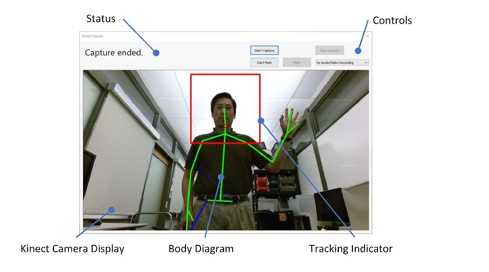
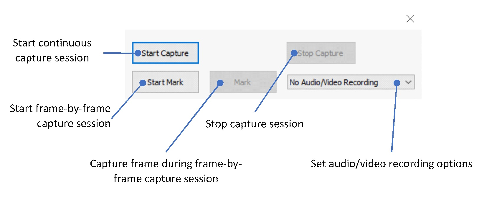

# Microsoft Applied Robotics Research Library:
# [Labanotation Suite](/README.md)

# **KinectReader User Manual**

## Introduction
The Kinect Reader captures Kinect body tracking sequences and optionally audio/video.  Capture sessions are suitable for conversion to Laban notion using the pyHumanObserver Kinect-to-Laban notation converter and for playback and breaking into segments using the Kinect Capture Editor.
## System Requirements
- Microsoft Windows 10, 64-bit
- Kinect Sensor v2 for Windows
- Kinect SDK v2.0 or newer for Kinect Sensor v2 *(Downloadable at https://www.microsoft.com/en-us/download/details.aspx?id=44561)*
- OpenCV Version 3.4.3 for Windows *(Downloadable at https://sourceforge.net/projects/opencvlibrary/files/opencv-win/3.4.3/opencv-3.4.3-vc14_vc15.exe/download)* 
## Installation
- Copy the Kinect Reader folder to a convenient application folder.
- Edit the file KinectReader.ini and set the DataDir property to a directory where the capture session data will be written.  See **INI File** section below
- Locate and place a copy of the OpenCV file **opencv_world343.dll** into the application folder, or add the existing location to your system's **Path** using Windows' **Advanced System Properties** control panel to set an **Environment Variable**.
## Example Use
The user wishes to create a set of reference poses with associated audio and video.
- Launch the Kinect Reader app.
- From the drop-down control on the right, select Record Audio & Video.
- Click on Start Capture.
- Perform each gesture and vocally name the gesture.
- Click on Stop Capture.
- The Kinect body data frames are saved to joints.csv and the audio/video recording is saved to videorecording.wmv.
## Starting Up and Shutdown
- To run, double-click KinectReader.exe.
- To exit, click on the close button at the top of the window or press Alt+F4 and click Yes on the close confirmation message box.
## The User Interface
The main application windows has three main areas: the Kinect camera display, status, and controls.
 
## Kinect Camera Display
The Kinect Camera Display at the bottom displays the color image from the Kinect sensor overlaid with a diagram of the body tracking data for each person being tracked by the camera.  Segments recognized by the Kinect sensor are green and inferred segments are blue.  Segments that are not recognized are not shown.
A red box highlights the person whose body tracking data will be recorded.  If the wrong person is being tracked, click on the head of the correct person.
## Status
The Status area at the top-left displays messages such as a capture session is active and when a frame is captured.
## Controls
The Controls area at the top-right configure and control a recording session.
  
- The media drop-down control specifies whether to record audio & video, audio-only, or not at all along with the Kinect data.
- The Start Capture button begins a continuous capture session.
- The Start Mark button begins a frame-by-frame capture session.  A Kinect data frame is only captured when the Mark button is pressed.
- The Stop Capture button stop the capture session and records the Kinect data, audio, and video to the output files.
The video is recorded from the Kinect’s color camera and the audio is recorded from the system default audio input device.  Set the input audio device or adjust the audio input level using the Windows Sound settings or control panel.
## Capture Sessions
A continuous capture session records each Kinect data frames, audio, and video as they are supplied by the Kinect sensor.  A frame-by-frame capture session records a Kinect data frame only when the Mark button is clicked.  When enabled, audio/video is recorded continuously for either session type.
The session files are saved to the directory specified by the DataDir property:
- The Kinect data frames are saved to joints.csv.
- When recording both audio and video, the recording is saved to videorecording.wmv.
- When recording audio only, the recording is saved to audiorecording.wma.
## Reference
### Keyboard Shortcuts
| Keys | Description |
|--|--|
|Alt+F4  | Exit the application |
## INI File
| [Section] Property=Value | Type| Description |
|--|--|--|
| **[main]** |  |  |
| DataDir= | String | Path to directory to contain session output files.  Relative paths are based on the directory containing application executable (KinectReader.exe). |
## Kinect Body Data File Format
The Kinect body data file is a Comma-Separated Values (CSV) text file (*.csv).  A data frame is a line of text terminated by a CR/LF pair and consists of a series of fields separated by commas (“,”).  Each field is the C programming language printf()-style text representation of the value.  The fields are the following:

|Field  | Type | Description |
|--|--|--|
| Timestamp |Integer  |Kinect sensor timestamp in hundred-nanosecond units (10,000,000 units = 1 second.)  The absolute value of the timestamp has no meaning but the timestamp allows calculating the elapsed time between frames and ordering frames by when they were captured.  |
| Joint Array |Tracked Joint  | A series of Tracked Joint entries, one per each of 25 joints. |
The fields that make up the Joint Array immediately follow the Timestamp field.  Each set of four fields form a Tracked Joint entry, one per each of 25 joints.  There is no special delineation between entries in the array nor between each field in each entry beyond the standard comma.  The Tracked Joint fields are:

| Field |Type  |Description  |
|--|--|--|
| X | Float | X coordinate of the joint in Kinect camera space |
| Y | Float | Y coordinate of the joint in Kinect camera space |
| Z | Float | Z coordinate of the joint in Kinect camera space |
| Tracking State | Integer | 	0 = joint is not tracked, 1 = joint position is inferred (estimated), 2 = joint is tracked |

Kinect camera space is defined as follows:
- The origin (X = 0, Y = 0, Z = 0) is at the center of the Kinect’s IR sensor
- X increases to the sensor’s left, from the sensor looking at the joint
- Y increases towards the sensor’s top
- Z increases away from the sensor to the joint
- Each whole unit is one meter (1.0 units = 1.0 meters)

See the Microsoft documentation Kinect for Windows SDK 2.0, “Programming Guide”, “Coordinate mapping” for more details.

The joints appear in the Joint Array in this order:
1. Spine Base
1. Spine Midsection
1. Neck
1. Head
1. Left Shoulder
1. Left Elbow
1. Left Wrist
1. Left Hand
1. Right Shoulder
1. Right Elbow
1. Right Wrist
1. Right Hand
1. Left Hip
1. Left Knee
1. Left Ankle
1. Left Foot
1. Right Hip
1. Right Knee
1. Right Ankle
1. Right Foot
1. Spine Shoulder
1. Left Hand Tip
1. Left Thumb
1. Right Hand Tip
1. Right Thumb

